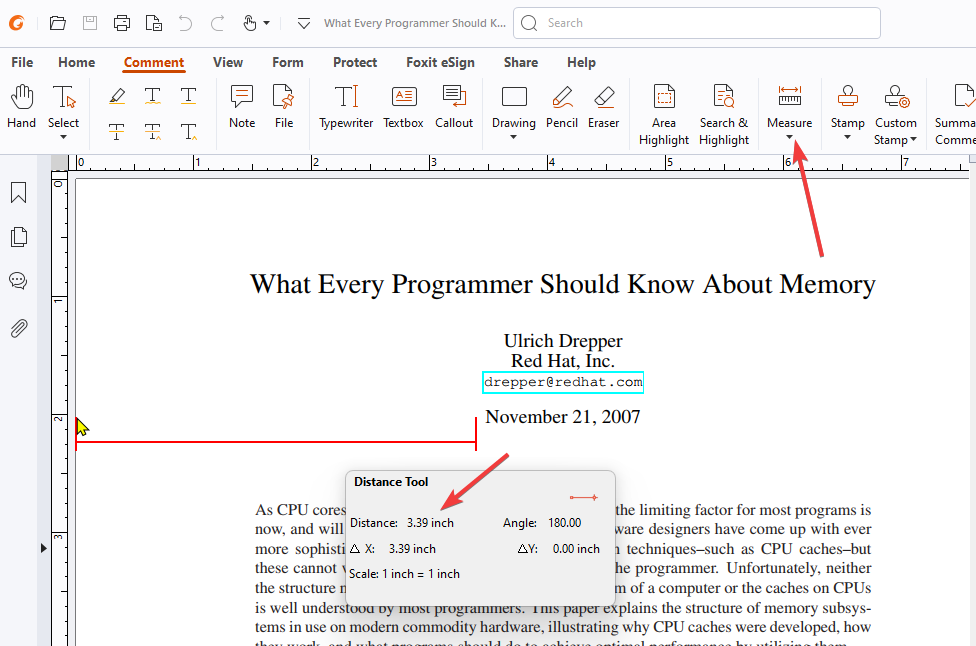

# Document Reader

Document Reader is an extremely simple console application created for my dear _freund_ Erik to make his boring job less boring.
It extracts text from specific areas of PDF files and generates an Excel file with the extracted data.

## Disclaimer
This is a very simple program that I created for my friend in an hour or so. It is not intended to be a full-fledged application with all the bells and whistles.
It is just a simple program that does the job.

## Features

- Extracts text from specified areas of PDF files
- Validates the configuration file using FluentValidation
- Generates an Excel file with the extracted data
- Provides visually appealing console output using Spectre.Console

## Configuration

The program uses a `config.json` file to define the areas from which text should be extracted. The configuration file
has the following structure:

```json
{
"Areas": [
 {
   "Name": "Area1",
   "X": 0.5,
   "Y": 9.8,
   "Width": 1.5,
   "Height": 0.4
 },
 {
   "Name": "Area2",
   "X": 0.5,
   "Y": 5.3,
   "Width": 0.39,
   "Height": 0.4
 }
]
}
```
- Areas: An array of area objects specifying the regions to extract text from.
- Name: The name of the area.
- X: The X-coordinate of the area's top-left corner.
- Y: The Y-coordinate of the area's top-left corner.
- Width: The width of the area.
- Height: The height of the area.

#### Please note that all coordinate values (X, Y, Width, and Height) are expected to be in inches.
The program will internally convert these values from inches to points (1 inch = 72 points) when processing the PDF files.

It's important to ensure that the coordinate values in the config.json file are accurate and specified in inches to achieve the desired text extraction results.

### How to get coordinates?

In my case I used FoxitReader to get the coordinates. You can use any PDF reader that shows the coordinates of the cursor.

